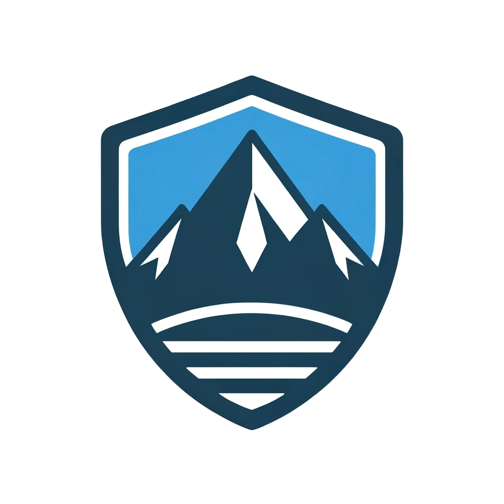

# 😎 Introduction

<figure><figcaption></figcaption></figure>

Welcome to the "Carpa Security Book" – your definitive guide in the dynamic world of cybersecurity. As a seasoned pentester and enthusiast, I've navigated the complexities of digital security and am here to share a distilled collection of the most effective tools and strategies.

**Why this book?** The digital landscape is awash with resources, making it challenging to find reliable and effective guidance. This book is a curated collection of the best tools, strategies, and insights I've encountered, designed to empower you with practical cybersecurity knowledge.

**What's Inside?**

* **In-depth Tutorials:** Straightforward guides on essential security practices and tools.
* **Resource Directory:** A handpicked selection of vital resources, tools, and communities.
* **Practical Advice:** Real-world strategies and tips from my experiences and those within our Discord community.

This book is more than a guide; it's an invitation to join a growing movement dedicated to cybersecurity awareness and education. Whether you're a seasoned professional, a curious student, or an enthusiastic beginner, there's a place for you in our community.

**Connect and Contribute:** Your insights, questions, and participation are what make this journey enriching. Join our Discord server and be part of a community eager to share, learn, and grow in the ever-evolving cybersecurity landscape.

[Discord](https://discord.gg/sjQqek6TWp)

[Carpa Security Academy ](https://carpa-sec.com)

[YouTube](https://www.youtube.com/@RichardArdelean)
